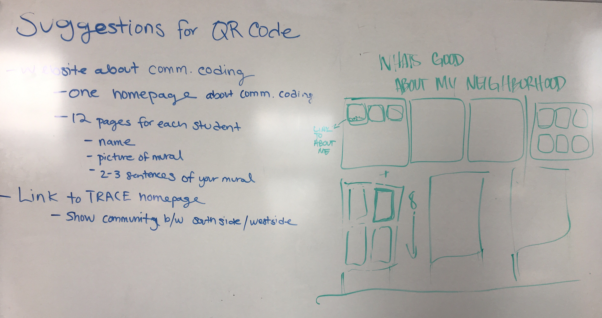

# COMMUNITY CODING

#### Course Number: 1489 + 1490
#### Dates: August 6 - August 17 (Mon - Fri), 2018
#### Instructors: Amanda Yamasaki, Teresa Bensel, Haman Cross III

### Course Description
Want to learn how to design and code an app? This course is about art and technology. We will learn about the internet of things and how tech can creatively interact with outdoor space like murals, community gardens and sculptures. We will explore our environment with field trips and outdoor projects and using data and tech to think creatively about our app design. This course is a unique collaboration between SAIC and North Lawndale. Come experiment with us! 
No coding experience necessary.   

### Course Outcomes
*In this course, students will...*

*Learn how to…* Design and build simple Internet of Things web applications. This course will provide context for current technology + internet and data, so that students will be able to think critically and creatively about these ubiquitous systems they interact with everyday.  Students will understand (at a high level) how the internet is working, and how we can leverage technology for self-care, creating community, and elaborating our rich cultural heritages. 

*Be inspired by…* Other individuals working within the disciplines of art, technology, and socially engaged design.  Students will also be inspired to imagine how we can re-create systems within technology.  

***

### DAILY CODE EXERCISES
 
[LESSON ONE](./1_lesson): Introduction to HTML & CSS - About Me App

[LESSON TWO](./2_lesson): Javascript, Functions & Conditionals - Songwriting Activity

[LESSON THREE](./3_lesson): Data Types - Self Care App

[Daily Feedback Form](https://docs.google.com/forms/d/e/1FAIpQLSfRpKr7MUh3Nw3T8MxQsQbpDjdpXJOg_oT5OzkEb6kPUEng-Q/viewform?c=0&w=1)

***

## MURAL + CLASS APP

[Lawndale Coding Template Page](https://glitch.com/edit/#!/lawndalecoding-template): Use this as a template for our website!

***

### RESOURCES

#### Coding resources

- [w3schools](https://www.w3schools.com/)
- [Stack Overflow](https://stackoverflow.com/)
- [CSS Tricks](https://css-tricks.com/)

Fun Sites
- [Hacker Typer](http://hackertyper.com/)
- [issa.website](https://issa.website/)